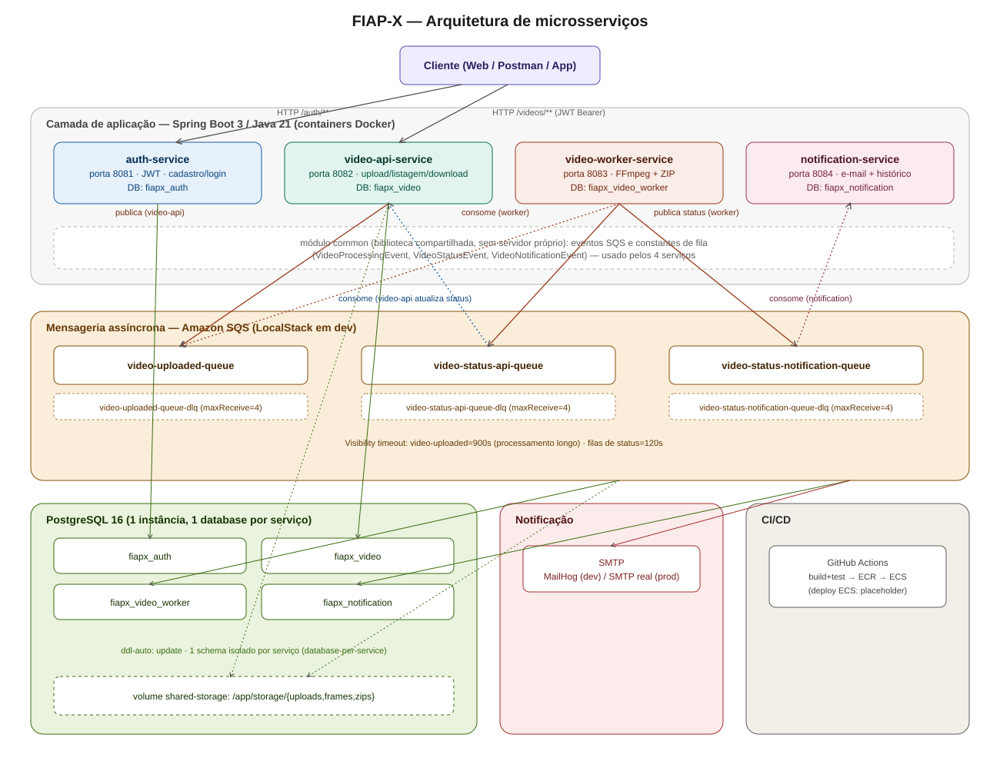
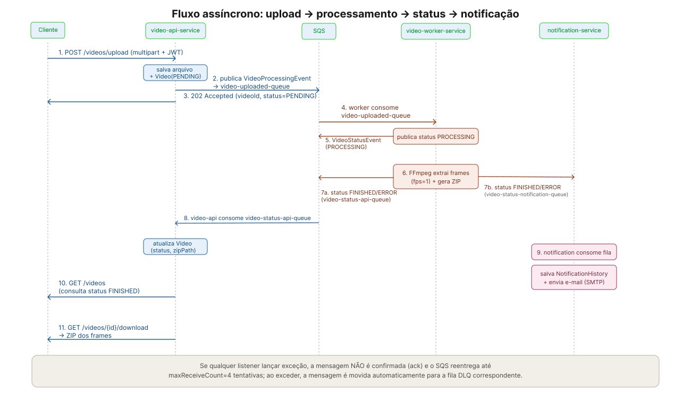
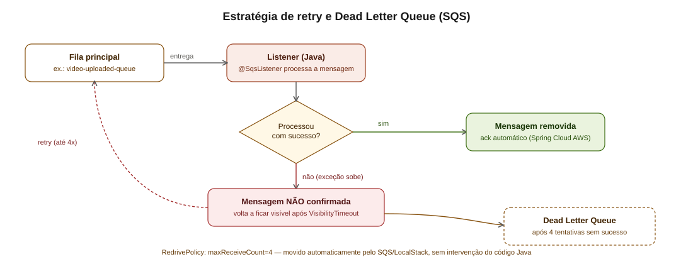

# Arquitetura do FIAP-X — Visão intermediária

Documentação de arquitetura do **fiap-x**, um sistema de processamento de vídeos organizado como monorepo de microsserviços em Java 21 / Spring Boot 3.2.8. O usuário envia um vídeo, o sistema extrai frames com **FFmpeg**, gera um `.zip` para download e notifica o usuário por e-mail — tudo isso de forma assíncrona, via filas **Amazon SQS** (emuladas com LocalStack em desenvolvimento).

## Serviços do projeto

| Serviço | Porta | Responsabilidade |
|---|---|---|
| `auth-service` | 8081 | Cadastro, login e emissão de JWT |
| `video-api-service` | 8082 | Upload, listagem, status e download de vídeos |
| `video-worker-service` | 8083 | Processamento pesado: FFmpeg + geração de ZIP |
| `notification-service` | 8084 | Histórico de notificações e envio de e-mail |
| `common` (biblioteca) | — | Eventos e nomes de fila compartilhados |

O projeto é um **monorepo Maven multi-módulo** (POM raiz do tipo `pom`, agregando os 5 módulos acima). Cada serviço de aplicação tem seu próprio `Dockerfile`, porta e banco de dados.

## Diagrama geral



Pontos-chave do desenho:

- O cliente só conversa diretamente com `auth-service` e `video-api-service`. Os outros dois serviços não têm API pública de negócio — reagem a eventos de fila.
- Cada serviço tem **seu próprio banco PostgreSQL** (`fiapx_auth`, `fiapx_video`, `fiapx_video_worker`, `fiapx_notification`), padrão *database-per-service*.
- A comunicação entre `video-api-service`, `video-worker-service` e `notification-service` acontece **só via SQS** — nenhum deles chama o outro por HTTP.
- O módulo `common` não roda sozinho: é uma dependência Maven embutida no `.jar` de cada serviço, garantindo o mesmo contrato de eventos e os mesmos nomes de fila em todos eles.

## Módulo `common`

Biblioteca compartilhada (sem porta, sem Dockerfile) com:

- `SqsQueueNames`: constantes com os nomes das 3 filas usadas no projeto.
- Três eventos (`record`s Java, serializados como JSON pelo Spring Cloud AWS):
    - `VideoProcessingEvent` — publicado pelo `video-api-service`, consumido pelo `video-worker-service`.
    - `VideoStatusEvent` — publicado pelo `video-worker-service`, consumido por `video-api-service` **e** `notification-service`.
    - `VideoNotificationEvent` — contrato reservado, não usado no fluxo principal atual.

## `auth-service`

Endpoints em `/auth`:

- `POST /auth/register` — cria usuário (senha com hash BCrypt). `409` se e-mail duplicado.
- `POST /auth/login` — valida credenciais e devolve um JWT (`Bearer`, expiração configurável, padrão 2h).
- `GET /auth/validate` — valida um token recebido (uso externo/manual; não é chamado pelos outros serviços internamente).

Tabela `users` (`fiapx_auth`): `id (UUID)`, `name`, `email (único)`, `password (hash)`, `created_at`.

## `video-api-service`

Endpoints em `/videos` (protegidos por JWT):

- `POST /videos/upload` (multipart) — valida extensão (`.mp4`, `.avi`, `.mkv`), salva o arquivo, cria `Video(status=PENDING)` e publica `VideoProcessingEvent` na fila `video-uploaded-queue`. Responde `202 Accepted` imediatamente.
- `GET /videos` — lista os vídeos do usuário autenticado.
- `GET /videos/{id}/download` — baixa o `.zip` processado (só quando `status = FINISHED`).

Também consome `video-status-api-queue` (`VideoStatusListener`) para atualizar o status do vídeo assim que o worker termina.

Tabela `videos` (`fiapx_video`): id, dados do usuário, título, caminhos de storage, `status` (`PENDING`/`PROCESSING`/`FINISHED`/`ERROR`), `error_message`, timestamps.

## `video-worker-service`

Sem API HTTP de negócio — acionado só por mensagens SQS. Fluxo (`VideoProcessingOrchestrator`):

1. Consome `VideoProcessingEvent` de `video-uploaded-queue`.
2. Publica status `PROCESSING`.
3. `FfmpegService` extrai 1 frame por segundo do vídeo original (`ffmpeg -vf fps=1`).
4. `ZipService` compacta os frames em `{videoId}.zip`.
5. Publica status final (`FINISHED` + caminho do zip, ou `ERROR` + mensagem) em **duas filas**: `video-status-api-queue` e `video-status-notification-queue`.
6. Remove o diretório temporário de frames (sempre, mesmo em erro).

**Tratamento de erro:** falhas de negócio "não recuperáveis" publicam `ERROR` e não relançam a exceção; falhas genéricas publicam `ERROR` **e relançam**, deixando o SQS reentregar a mensagem (retry) e, depois de esgotar as tentativas, movê-la para a DLQ.

A imagem Docker deste serviço instala o binário `ffmpeg` (via `apt-get`), diferente dos demais.

## `notification-service`

Endpoint `GET /notifications` (protegido por JWT) — lista o histórico de notificações do usuário.

Consome `video-status-notification-queue` (`VideoStatusListener`): normaliza o status (`FINISHED` ou `ERROR`), salva um registro em `NotificationHistory` e envia e-mail via SMTP (`JavaMailSender`, apontado para o **MailHog** em desenvolvimento). Assim como o worker, não engole exceções — falha no envio ou na gravação propaga o erro para o mecanismo de retry/DLQ do SQS.

## Fluxo assíncrono ponta a ponta



1. Cliente faz upload → `video-api-service` salva o arquivo, cria o registro `PENDING` e publica evento em `video-uploaded-queue`. Responde `202` na hora.
2. `video-worker-service` consome o evento, publica `PROCESSING`, roda FFmpeg, gera o ZIP.
3. O worker publica o status final em **duas** filas de status.
4. `video-api-service` consome sua fila e atualiza o vídeo no banco.
5. `notification-service` consome a sua e envia o e-mail + grava histórico.
6. Cliente consulta `GET /videos` e baixa o resultado quando `FINISHED`.

## Mensageria e Dead Letter Queue

| Fila | Publicador → Consumidor | Visibility timeout |
|---|---|---|
| `video-uploaded-queue` | video-api → worker | 900s |
| `video-status-api-queue` | worker → video-api | 120s |
| `video-status-notification-queue` | worker → notification | 120s |

Cada fila tem uma DLQ correspondente (`<fila>-dlq`), criada e configurada pelo script `docker/localstack/init/01-create-sqs-queues.sh`, que aplica uma `RedrivePolicy` com `maxReceiveCount=4`: a mensagem pode falhar até 4 vezes antes de ser movida automaticamente para a DLQ **pelo próprio SQS**.

A parte que cabe ao código Java é simples, mas essencial: **nunca engolir a exceção**. Se um listener capturar o erro e não relançar, o Spring entende que deu certo, confirma (ack) a mensagem — e ela nunca chega à DLQ mesmo tendo falhado de verdade. Por isso todos os listeners seguem o padrão de logar e relançar a exceção.



Documentação detalhada (incluindo comandos de inspeção e reprocessamento manual da DLQ) está em `informacoes/funcionamento-dlq.md`.

## Segurança (JWT)

- Só o `auth-service` **emite** tokens (HMAC, via biblioteca `jjwt`).
- `video-api-service` e `notification-service` **validam o token localmente**, usando o mesmo `JWT_SECRET` compartilhado — sem chamar o `auth-service` a cada requisição. Isso reduz latência e acoplamento, mas exige manter o segredo sincronizado entre os três serviços.
- Todas as configurações de segurança usam sessão stateless, sem CSRF/Basic/form login, com um `JwtAuthenticationFilter` próprio em cada serviço.

## Armazenamento de arquivos

`video-api-service` e `video-worker-service` compartilham um **volume Docker** (`shared-storage`), montado em `/app/storage`, com três subpastas: `uploads` (vídeo original), `frames` (temporário, apagado após o processamento) e `zips` (resultado final, disponível para download).

## Infraestrutura local (docker-compose)

| Container | Função |
|---|---|
| `fiapx-postgres` | 1 instância PostgreSQL 16, com os 4 databases criados via script de init |
| `fiapx-localstack` | Emula SQS localmente; cria as 3 filas + DLQs na subida |
| `fiapx-sqs-admin` | UI web para inspecionar as filas |
| `fiapx-mailhog` | SMTP fake + UI de e-mails recebidos (`:8025`) |
| `fiapx-auth-service` ... `fiapx-notification-service` | Os 4 serviços da aplicação |

Todos os serviços de aplicação sobem só depois que suas dependências passam no healthcheck (`condition: service_healthy`).

## Build e CI/CD

Cada serviço tem um `Dockerfile` multi-stage: build com Maven (`maven:3.9.8-eclipse-temurin-21`) copiando só o(s) módulo(s) necessário(s), seguido de uma imagem final enxuta (`eclipse-temurin:21-jre`) que só contém o `.jar`. O `video-worker-service` adicionalmente instala `ffmpeg` na imagem final.

O pipeline (`.github/workflows/ci.yml`) roda `mvn clean test` em todo push/PR, e em push para `main` builda e publica as 4 imagens no **Amazon ECR** (com autenticação OIDC), com um job final (hoje um placeholder) para deploy no **Amazon ECS**.

## Como rodar localmente

```bash
docker compose up --build
```

Isso sobe banco, filas, SMTP fake e os 4 serviços, na ordem correta. Depois:

```bash
curl -X POST http://localhost:8081/auth/register -H "Content-Type: application/json" \
  -d '{"name":"Fulano","email":"fulano@teste.com","password":"senha123"}'

curl -X POST http://localhost:8081/auth/login -H "Content-Type: application/json" \
  -d '{"email":"fulano@teste.com","password":"senha123"}'

curl -X POST http://localhost:8082/videos/upload -H "Authorization: Bearer <TOKEN>" \
  -F "file=@meu-video.mp4"
```

Acompanhe e-mails em `http://localhost:8025` e as filas em `http://localhost:3999`.

## Principais decisões de arquitetura

- **Database-per-service**: isolamento total de dados, ao custo de a entidade `Video` existir duplicada (conceitualmente) em `video-api-service` e `video-worker-service`.
- **SQS puro, sem fan-out (SNS)**: o worker publica o mesmo evento de status duas vezes (uma por fila), mantendo a infraestrutura simples.
- **JWT validado localmente em cada serviço**: elimina uma chamada de rede por requisição, em troca de precisar manter o segredo sincronizado.
- **DLQ configurada na infraestrutura, não no código**: o Java só precisa deixar a exceção subir; quem decide mover a mensagem para a DLQ é o próprio SQS.