# FIAP X - Processador de Vídeos Distribuído

Repositório designado para realização da fase 05 da pós-graduação FIAP.


---

# Relatório de Comparação Arquitetural: Projeto Base (Go) vs. FIAP-X (Java)

Este documento apresenta a análise comparativa entre a aplicação monolítica inicial fornecida como base e a arquitetura distribuída e orientada a eventos desenvolvida no **FIAP-X**, em conformidade com as boas práticas e padrões ensinados na pós-graduação.

---

## 1. Visão Geral Comparativa dos Fluxos

```mermaid
flowchart TD
    subgraph ProjetoBase ["1. Projeto Base (Go - Monólito Síncrono)"]
        ClientA[Cliente Web / Browser] -->|POST /upload Vídeo| Mono[Monólito Go: main.go]
        Mono -->|Execução Síncrona Bloqueante| FF1[FFmpeg local]
        FF1 -->|Gera ZIP em disco| Mono
        Mono -->|Retorna resposta HTTP após todo o processamento| ClientA
    end

    subgraph FIAPX ["2. Projeto Evoluído (Java - Microsserviços Orientados a Eventos)"]
        ClientB[Cliente / SPA / Postman] -->|1. Login/Cadastro| AuthSvc[Auth Service :8081\n+ DB Auth Postgres]
        ClientB -->|2. POST /api/videos + JWT| ApiSvc[Video API Service :8082\n+ DB Video Postgres]
        ApiSvc -->|3. Salva vídeo e publica evento| SQS1[(AWS SQS: video-uploaded-queue)]
        ApiSvc -.->|Retorna 202 Accepted imediatamente| ClientB
        
        SQS1 -->|4. Consome mensagem| WorkerSvc[Video Worker Service :8083\n+ DB Worker Postgres]
        WorkerSvc -->|5. Executa FFmpeg e gera ZIP| SharedStorage[(Shared Storage / Volume)]
        WorkerSvc -->|6. Publica status COMPLETED/FAILED| SQS2[(AWS SQS: video-status-queues)]
        
        SQS2 -->|Atualiza status do vídeo| ApiSvc
        SQS2 -->|Envia e-mail com link do ZIP| NotifSvc[Notification Service :8084\n+ MailHog :8025]
    end
```



---

## 2. Tabela Comparativa Lado a Lado

| Aspecto / Funcionalidade | Projeto Base (Go) | Projeto Evoluído: FIAP-X (Java) |
| :--- | :--- | :--- |
| **Estilo Arquitetural** | **Monólito Único** (`main.go`) | **Microsserviços Distribuídos** (4 serviços independentes) |
| **Linguagem & Framework** | Go 1.21 + Gin Framework | Java 21 + Spring Boot 3 + Spring Data JPA + Spring Security |
| **Processamento** | **Síncrono e Bloqueante** (o cliente aguarda a conversão terminar na requisição HTTP) | **Assíncrono e Reativo** (o cliente recebe `202 Accepted` imediatamente; processamento ocorre em background) |
| **Mensageria / Eventos** | Inexistente (chamadas diretas no mesmo processo) | **AWS SQS** (simulado via LocalStack) com 3 filas de mensageria |
| **Autenticação & Segurança** | Inexistente (acesso anônimo e irrestrito) | **JWT (JSON Web Token)** com Spring Security, roles e isolamento de dados por usuário |
| **Persistência de Dados** | **Sem banco de dados** (apenas sistema de arquivos local) | **PostgreSQL** com isolamento (*Database-per-Service*: 4 bancos distintos) |
| **Worker Dedicado** | Inexistente (a própria API Web executa o FFmpeg) | **`video-worker-service` dedicado e escalável horizontalmente** |
| **Notificações** | Inexistente (usuário precisa aguardar na tela ou consultar a lista) | **`notification-service`** enviando e-mails via SMTP (**MailHog**) |
| **Rastreamento de Status** | Não há controle de ciclo de vida | **Máquina de Estados de Vídeo** (`RECEIVED`, `PROCESSING`, `COMPLETED`, `FAILED`) |
| **Interface / Contrato** | HTML/CSS/JS simples embutido em string | API RESTful desacoplada (pronta para qualquer frontend SPA/Mobile) |
| **Resiliência e Escalabilidade** | Se o FFmpeg travar ou usar 100% de CPU, a API cai | Se o worker travar, a API continua operacional recebendo uploads e enfileirando |

---

## 3. Detalhamento Funcionalidade por Funcionalidade

### 3.1. Autenticação e Gestão de Usuários
* **Projeto Base (Go):**
  - Não possui conceito de usuário, sessão ou proteção de rotas. Qualquer pessoa acessa qualquer vídeo processado.
* **FIAP-X (`auth-service`):**
  - Serviço dedicado com endpoints para **Registro** (`/api/auth/register`) e **Login** (`/api/auth/login`).
  - Senhas criptografadas com `BCrypt`.
  - Emissão de tokens **JWT** stateless assinados criptograficamente.
  - As demais APIs (`video-api-service`, `notification-service`) validam a assinatura do JWT nas requisições, garantindo que usuários acessem apenas seus próprios vídeos.

---

### 3.2. Recepção e Upload de Vídeos
* **Projeto Base (Go):**
  - O endpoint `POST /upload` no `main.go` recebe o arquivo, grava na pasta `uploads/` e imediatamente chama a função de conversão síncrona `processVideo()`.
* **FIAP-X (`video-api-service`):**
  - O controller recebe o arquivo multipart autenticado.
  - Salva o arquivo no storage compartilhado e registra o metadado no banco de dados (`fiapx_video`) com status `RECEIVED`.
  - Publica uma mensagem na fila SQS `video-uploaded-queue`.
  - **Retorna HTTP 202 (Accepted)** com o ID do vídeo para o cliente, liberando a conexão em milissegundos.

---

### 3.3. Processamento e Extração de Frames (FFmpeg + ZIP)
* **Projeto Base (Go):**
  - O comando `ffmpeg` roda no mesmo thread/processo que atende a requisição HTTP.
  - Cria pasta em `temp/<timestamp>`, roda `-vf fps=1`, compacta usando `archive/zip` nativo do Go e apaga a pasta temporária.
* **FIAP-X (`video-worker-service`):**
  - Microsserviço independente (Worker) com `@SqsListener` escutando a fila `video-uploaded-queue`.
  - Ao receber a mensagem, orquestra via `VideoProcessingOrchestrator`:
    1. Atualiza status para `PROCESSING`.
    2. Executa `FfmpegService` extraindo os frames a 1 fps.
    3. Executa `ZipService` gerando o arquivo compactado final.
    4. Notifica via SQS (`video-status-api-queue` e `video-status-notification-queue`) que o vídeo foi `COMPLETED` ou `FAILED`.

---

### 3.4. Comunicação e Mensageria (Event-Driven Architecture)
* **Projeto Base (Go):**
  - Acoplamento total: todo o processamento e respostas ocorrem em uma única chamada de função.
* **FIAP-X:**
  - Utiliza **3 filas SQS** no LocalStack:
    1. `video-uploaded-queue`: Notifica o worker para iniciar o processamento.
    2. `video-status-api-queue`: Notifica a API para atualizar o status no banco de dados.
    3. `video-status-notification-queue`: Notifica o serviço de e-mail para avisar o usuário.

---

### 3.5. Sistema de Notificações
* **Projeto Base (Go):**
  - Inexistente.
* **FIAP-X (`notification-service`):**
  - Escuta a fila de status. Quando o processamento atinge `COMPLETED` ou `FAILED`, dispara um e-mail formatado para o usuário via **MailHog** (servidor SMTP com dashboard na porta `8025`).

---

### 3.6. Persistência de Dados e Padrões de Banco
* **Projeto Base (Go):**
  - Sem banco de dados. A listagem de vídeos em `/api/status` faz um `filepath.Glob("outputs/*.zip")` inspecionando arquivos no disco local.
* **FIAP-X:**
  - Padrão **Database-per-Service**: Cada microsserviço possui seu próprio banco de dados isolado no PostgreSQL:
    - `fiapx_auth`: Usuários e credenciais.
    - `fiapx_video`: Vídeos, metadados, status do processamento, tamanho, timestamps e autor.
    - `fiapx_video_worker`: Histórico de execuções de jobs e logs de erros de processamento.
    - `fiapx_notification`: Histórico e status de entrega de notificações.

---

## 4. Técnicas e Padrões da Pós-Tech Aplicados no FIAP-X

1. **Arquitetura de Microsserviços e Separação de Responsabilidades (SoC)**:
   - Divisão clara de domínios (Auth, Ingestion/API, Processing/Worker, Notifications).
2. **Event-Driven Architecture (EDA) & Desacoplamento Assíncrono**:
   - Filas para absorver picos de tráfego (*load leveling*), prevenindo indisponibilidade da API em momentos de alta demanda.
3. **Escalabilidade Horizontal Independente**:
   - O `video-worker-service` pode ser escalado horizontalmente (múltiplas instâncias consumindo da mesma fila) sem onerar a API ou o Auth Service.
4. **Tratamento Global de Erros e DTOs**:
   - Handlers centralizados (`ApiExceptionHandler` com `@RestControllerAdvice`) padronizando respostas RFC 7807 (Problem Details).
5. **Observabilidade e Health Checks**:
   - Healthchecks no `docker-compose.yml` para PostgreSQL, LocalStack e MailHog com `condition: service_healthy`, garantindo inicialização ordenada e confiável do ecossistema.

---

## 5. Resumo da Evolução

| De (Projeto Base Go) | Para (Projeto FIAP-X Java) |
| :--- | :--- |
| **Monólito simples** em 1 arquivo | **Ecossistema de Microsserviços** desacoplados |
| Bloqueio HTTP durante processamento | Resposta imediata (`202 Accepted`) + Filas SQS |
| Sem segurança | Autenticação robusta com Spring Security & JWT |
| Sem persistência | 4 Bancos de dados PostgreSQL dedicados |
| Sem feedback externo | Notificações por e-mail em tempo real (MailHog) |
| CPU e I/O concorrendo no mesmo processo | Workers de processamento isolados e auto-escaláveis |

---

## 6. Guia de Configuração do CI/CD (GitHub Actions & Docker Hub)

Este guia orienta os membros da equipe a configurarem seus respectivos forks no GitHub e contas no Docker Hub para que a esteira de CI/CD execute com sucesso.

### 6.1. Configuração no Docker Hub

1. **Criar uma conta no Docker Hub** (caso ainda não possua): [https://hub.docker.com/](https://hub.docker.com/).
2. **Gerar um Personal Access Token (PAT)**:
   - No Docker Hub, clique no seu perfil (canto superior direito) -> **Account Settings**.
   - Acesse **Security** -> **Personal access tokens** -> **Generate new token**.
   - **Descrição**: Ex. `github-actions-fiapx`.
   - **Access permissions**: Selecione obrigatoriamente **Read & Write** (ou *Read, Write, Delete*).
   - Copie o token gerado.
3. *(Opcional)* **Criar os 4 repositórios públicos**:
   - Se preferir criar previamente, crie com visibilidade **Public**:
     - `<SEU_USUARIO>/auth-service`
     - `<SEU_USUARIO>/video-api-service`
     - `<SEU_USUARIO>/video-worker-service`
     - `<SEU_USUARIO>/notification-service`

---

### 6.2. Configuração no Repositório GitHub (Fork)

Acesse o seu Fork no GitHub e vá em **Settings** -> **Secrets and variables** -> **Actions**:

#### A. Secrets do Repositório (Aba *Secrets*)
Clique em **New repository secret** e cadastre:
* **`DOCKERHUB_USERNAME`**: Seu nome de usuário no Docker Hub.
* **`DOCKERHUB_TOKEN`**: O Personal Access Token (PAT) gerado no passo anterior.

#### B. Variáveis do Repositório (Aba *Variables*)
Clique em **New repository variable** e cadastre:
* **`ENABLE_ECS_DEPLOY`**: Valor `false` (indica que a esteira deve publicar as imagens no Docker Hub em vez do AWS ECS).

#### C. Habilitar Actions e Permissões de Escrita
1. Vá em **Settings** -> **Actions** -> **General**.
2. Em **Actions permissions**, selecione **Allow all actions and reusable workflows**.
3. Em **Workflow permissions**, selecione **Read and write permissions**.
4. Acesse a aba **Actions** no topo do repositório e clique em **"I understand my workflows, go ahead and enable them"** caso apareça o aviso de ações desabilitadas.

---

### 6.3. Fluxo de Execução e Branch Protection

Como a regra do projeto proíbe commits diretos na branch `main`:

1. **Desenvolvimento em branch de feature**:
   ```bash
   git checkout -b feat/sua-feature
   # realize suas alterações...
   git commit -m "feat: sua funcionalidade"
   git push origin feat/sua-feature
   ```
2. **Pull Request**:
   - Abra o PR apontando para a branch `main` do seu próprio Fork.
   - O GitHub Actions executará automaticamente o job de CI (`build-and-test`).
3. **Merge na `main`**:
   - Após os testes passarem, realize o merge do PR.
   - O merge disparará automaticamente a etapa de **CD** (`build-and-push-images`), gerando e publicando as imagens dos 4 microsserviços no seu Docker Hub com as tags `latest` e `sha-<hash>`.
4. **Disparo Manual (Opcional)**:
   - Na aba **Actions** -> selecione **FIAP-X CI/CD** -> clique em **Run workflow** para executar a esteira manualmente a qualquer momento.

